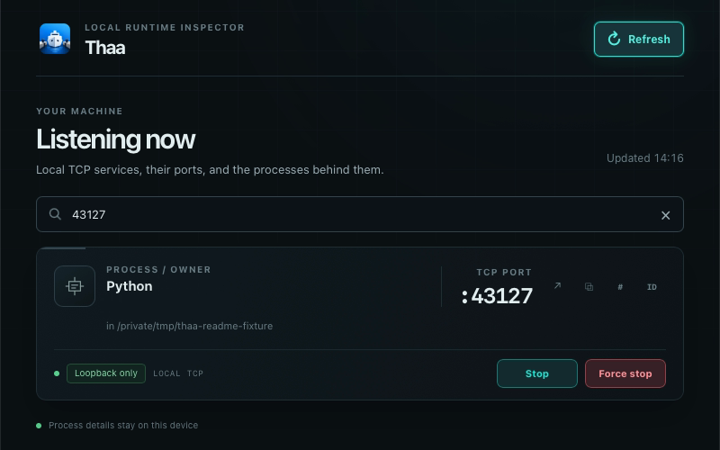

  

<h1 align="center">Thaa</h1>

<strong>Know what's listening.</strong>

  
  
  
  

Thaa is a cross-platform local runtime and port inspector for developers. It
shows which processes own local TCP listeners, the process and project context
available on your system, and gives you quick ways to search, copy, open, or
safely request supported process actions.

> **Early Preview:** Thaa `v0.1.1` is the current release for selected testers.
> It fixes the invalid macOS app-bundle signature in `v0.1.0`. The macOS app
> remains ad-hoc signed, without Developer ID signing or notarization, and may
> show a first-launch security warning. The Windows installer is unsigned and
> may also trigger operating-system warnings or blocks.

---

## Tired of fighting “port already in use”?

You sit down to code, start your dev server, and—port 3000 is already taken.
Now the side quest begins: find the process, look up its PID, remember the
right command, and work out whether it is safe to stop. Maybe you open a search
tab or ask a teammate, all because one port refused to cooperate.

**Thaa puts the answer a few clicks away.**

## What is Thaa?

Thaa (ท่า) is a Thai word associated with a port, harbor, or dock. The name
connects network ports with a harbor: Thaa gives you a local view of what is
occupying each port, helps identify its process, and lets you inspect it before
you take action.

Thaa works on your computer. It does not require an account, cloud service, or
telemetry to inspect local listeners.

## Features

- Discover local listening TCP ports and their process owners when the
  operating system can identify them.
- Inspect process names, PIDs, and available executable, working-directory,
  and project-root context.
- See native process icons where available, with clear fallback icons.
- Search by process name or exact port number.
- Refresh the listener snapshot and copy a URL, port, or PID.
- Open a validated local service URL.
- Request a supported graceful Stop or explicitly confirm Force Stop. Thaa
  reports a request as sent; a later scan confirms whether the process exited.
- Use the macOS menu bar or Windows system tray for quick access.

## Screenshots

The screenshot uses a temporary loopback-only test server. Its dynamic PID and
ambient listener count are omitted.

## Quick Start

1. Download Thaa `v0.1.1` from the [official GitHub Pre-release](https://github.com/thg1rb/thaa/releases/tag/v0.1.1). It includes packages for macOS Apple Silicon and Windows x64.
2. Install and launch Thaa.
3. Search for a process name or port, such as `chrome` or `3000`.
4. Inspect the listener and its available process/project details.
5. Copy or open its local URL, or request a supported process action when you understand what it does.

## Installation

Thaa `v0.1.1` is an **Early Preview for selected testers**, not a stable,
production-ready, or warning-free general release. Download only from the
[official v0.1.1 GitHub Pre-release](https://github.com/thg1rb/thaa/releases/tag/v0.1.1)
and verify the package with its published `SHA256SUMS.txt` where practical.

### macOS — Apple Silicon, macOS 15+

Download [`Thaa_0.1.1_aarch64.dmg`](https://github.com/thg1rb/thaa/releases/download/v0.1.1/Thaa_0.1.1_aarch64.dmg)
and [`SHA256SUMS.txt`](https://github.com/thg1rb/thaa/releases/download/v0.1.1/SHA256SUMS.txt)
from the official release. The DMG is validly ad-hoc signed, but it is not
Developer ID signed or notarized. macOS may show a verification warning at
first launch. If macOS offers its supported per-app approval flow, use
**System Settings → Privacy & Security → Open Anyway**. Wording and available
controls vary by macOS version.
If you see “Thaa is damaged and can’t be opened” or a specific malware/XProtect
block, stop and report it. Do not disable Gatekeeper or other security
features globally, remove quarantine broadly, or change SIP.

The `v0.1.0` macOS DMG has a historical invalid-signature defect and should
not be used; this was fixed in `v0.1.1`. The [v0.1.0 release page](https://github.com/thg1rb/thaa/releases/tag/v0.1.0)
retains the incident notice.

Never disable Gatekeeper or other macOS security features globally. For
Apple's current per-app guidance, see [Open apps safely on your
Mac](https://support.apple.com/en-ie/102445). Report unexpected behavior
through [Issues](https://github.com/thg1rb/thaa/issues).

### Windows

The `v0.1.1` release target is Windows 11 x64. The installer is an unsigned
NSIS package named `Thaa_0.1.1_x64-setup.exe`; no MSI is provided.
SmartScreen may warn, and [Smart App
Control](https://learn.microsoft.com/en-us/windows/apps/package-and-deploy/smartscreen-reputation)
or an organization policy may block installation completely. If Windows
offers **More info → Run anyway**, continue only after confirming the installer
came from the official Thaa release and checking its SHA-256 entry. Do not
disable Windows security protections.

1. Download [`Thaa_0.1.1_x64-setup.exe`](https://github.com/thg1rb/thaa/releases/download/v0.1.1/Thaa_0.1.1_x64-setup.exe) and [`SHA256SUMS.txt`](https://github.com/thg1rb/thaa/releases/download/v0.1.1/SHA256SUMS.txt) from the official v0.1.1 release.
   In PowerShell, from the download folder, run
   `Get-FileHash .\Thaa_0.1.1_x64-setup.exe -Algorithm SHA256` and compare
   the hash with the Windows installer entry in `SHA256SUMS.txt`.
2. Run the installer and follow its prompts.
3. Launch Thaa from the Start menu. To uninstall, use **Settings → Apps → Installed apps**.

## How to use

If your dev server reports that port 3000 is busy:

1. Open Thaa and search for `3000`.
2. Inspect the process name, PID, address, and available working-directory or project-root context.
3. Copy the port, PID, or local URL if you need it elsewhere.
4. Before stopping anything, make sure you recognize the process. Use graceful
   Stop when available and appropriate. Force Stop is a stronger action and
   requires explicit confirmation.
5. Return to your terminal and start the dev server again.

Stop actions depend on platform support and operating-system permissions. A
successful request is not proof that a process exited; Thaa checks again on a
later scan.

## Platform support

| Capability                           | macOS                                               | Windows                                             |
| ------------------------------------ | --------------------------------------------------- | --------------------------------------------------- |
| Listening TCP port discovery         | Supported                                           | Supported                                           |
| Process name and PID                 | Supported when available                            | Supported when available                            |
| Search by process name or exact port | Supported                                           | Supported                                           |
| Working Directory                    | Available where process inspection permits          | Unavailable in the current provider                 |
| Project Root                         | Best-effort from available Working Directory        | Unavailable while Working Directory is unavailable  |
| Graceful Stop                        | Supported where the OS permits                      | Not supported for arbitrary discovered processes    |
| Force Stop                           | Supported with identity validation and confirmation | Supported with identity validation and confirmation |
| Desktop quick access                 | Menu bar                                            | System tray                                         |

## Known limitations

- Thaa currently inspects local TCP listeners; it is not a general system
  monitor or network scanner.
- Process metadata depends on what the operating system permits Thaa to
  inspect. Missing metadata does not prevent a listener from appearing.
- The Windows provider does not currently expose process Working Directory,
  so Project Root is unavailable there.
- Windows does not provide a safe generic graceful-stop operation for
  arbitrary discovered processes. Force Stop remains separate and explicit.
- Linux is not a supported release target.
- The current v0.1.1 macOS Early Preview is not Developer ID signed or Apple
  notarized; macOS may warn or block its first launch.
- The current v0.1.1 Windows NSIS installer is unsigned; SmartScreen, Smart
  App Control, or managed-device policy may warn or block installation.

## Security

Thaa reads local listener and process metadata and keeps it on this device by
default. Process termination can disrupt work: inspect a target before acting,
and remember Force Stop is destructive. Read the [security policy](SECURITY.md)
to report a vulnerability privately.

## Contributing

Contributions and bug reports are welcome. Start with
[CONTRIBUTING.md](CONTRIBUTING.md) for development setup, branch and pull
request expectations, and validation steps. For user-facing bugs or feedback,
open a report in [GitHub Issues](https://github.com/thg1rb/thaa/issues) and
remove private process names, paths, and command data from screenshots.

## Development

Building from source requires Node.js 24, pnpm 10.29.2, Rust 1.99.0, and the
native prerequisites for your platform. Follow [Local Setup](docs/development/LOCAL-SETUP.md),
then use `pnpm install --frozen-lockfile` and `pnpm tauri dev`. See
[Development](docs/development/DEVELOPMENT.md) for tests and quality checks.
These tools are for development; they are not required to install a released
build.

## License

Thaa is released under the [MIT License](LICENSE). Third-party components and
notices retain their respective licenses.
