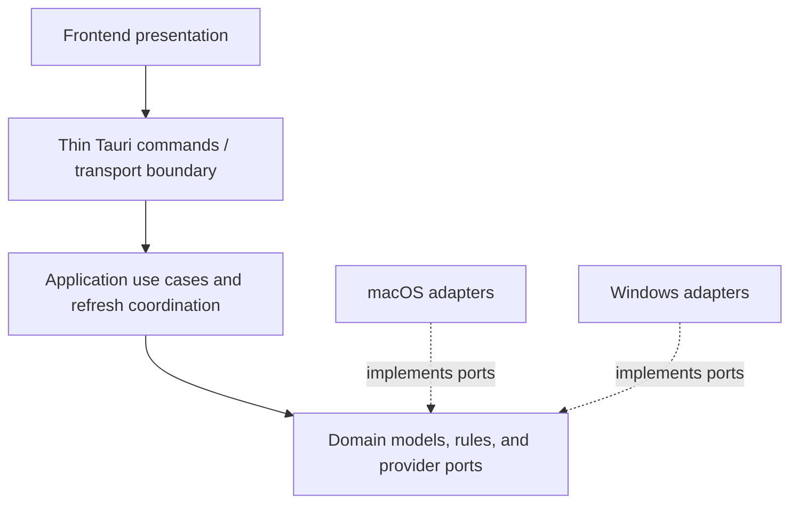

# Architecture Overview

**Applies to:** `THAA-REQ-0.1` · **Status:** Initial architecture baseline

## Design goals

Thaa shares domain and application behavior while isolating native macOS and Windows interactions. The design supports truthful unavailable states, safe process actions, local operation, and substitutable providers. It is Clean/Hexagonal-inspired, not a requirement to create a type or wrapper for every operation.

## Layers and dependency direction



The arrows from the frontend toward the domain describe runtime requests. Adapter implementation dependencies point inward to domain contracts; the composition root supplies implementations and application calls dispatch through those contracts. Domain and application code must not import Tauri, React, shell output formats, or OS-specific APIs. `cfg` selection belongs in platform/infrastructure composition only.

### Domain

Own normalized values, invariants, small pure classifications, capability concepts, and stable provider ports. Types use cross-platform values; they do not encode `lsof`, IP Helper, Tauri, or UI details.

### Application

Own use-case orchestration: inspect listeners, enrich them with process information, request refresh, and coordinate safe process actions. It depends on domain contracts and contains no native API code. Before a stop action it asks `ProcessController` to verify current identity evidence as part of its action operation, so no separate asynchronous inspection sits between verification and the native action.

W011 implements `application::process_inspection::inspect_processes` as a
small shared use case over caller-supplied process IDs and the W010
`ProcessProvider`. Each distinct PID is inspected once in first-seen order;
success or query error stays attached to that PID. It performs no listener
lookup, refresh scheduling, caching, or process action.

W013 adds `application::runtime_inspection::RuntimeInspector`, which performs
one port query, enriches unique owner PIDs through W011, preserves every
listener row and its per-process result, and commits one generation-scoped
snapshot. The same coordinator serves the main window and tray. Synchronous
native work is dispatched to Tauri's blocking pool; React receives explicit
transport DTOs and cannot send a PID as action authorization. Backend-held
snapshot references resolve to W012 identity-bound targets, after which the
platform controller still performs final native identity revalidation.

### Infrastructure and platform adapters

Shared infrastructure contains platform-neutral serialization or utilities only where needed. Platform adapters implement ports, translate native results into normalized values, and keep parsing/native error details local. macOS and Windows code live in separate modules selected at composition time.

### Tauri boundary

Commands validate all frontend inputs, call one application use case, and map domain/application outcomes into transport DTOs. They do not own scan logic, process policy, or native calls. Raw stack traces and native error strings do not cross to the UI.

### Frontend presentation

Feature-oriented React/TypeScript presentation owns rendering, interaction, accessibility, transient view state, and user-facing error copy. It requests snapshots and actions through Tauri only; it does not inspect processes or ports itself. Do not introduce a global state library until actual UI needs establish one.

## Composition and source layout

Startup is the composition root: select the target platform adapter, construct shared providers/use cases/coordinator, then register thin Tauri commands. Use ordinary Rust constructors and owned/shared handles; no dependency-injection framework is justified.

Proposed source organization once the later application bootstrap begins (do not create these directories in W003):

```text
src-tauri/src/
  domain/          # models, rules, ports
  application/     # use cases and refresh coordinator
  infrastructure/  # shared adapters and serialization support
  platform/
    macos/         # macOS provider implementations
    windows/       # Windows provider implementations
  commands/        # thin Tauri command handlers and DTO mapping
  lib.rs           # composition root
src/
  app/             # app shell and navigation
  components/      # reusable presentation components
  features/        # ports, processes, tray-facing views
  hooks/           # focused UI hooks
  lib/             # Tauri client and shared frontend utilities
  types/           # transport/view types where needed
```

The eventual feature set should be focused on P0 ports/processes. Do not create empty modules or P1 project-detection modules before those work items.

## Rust and TypeScript boundary

Rust owns backend transport DTO definitions and serialization. Use stable lower-camel JSON field names, explicit enum representations, and structured error codes. The frontend mirrors only DTOs it consumes. Keep both sides changed together and cover serialization/expected shape in contract checks. Because the frontend and backend ship as one application, do not add protocol versioning or a generator without demonstrated drift or independent-versioning needs. Unknown error codes must render a safe generic message; internal diagnostics remain backend-only.

## Security constraints

All process-provided strings and paths are untrusted. Use structured OS APIs or safe argument passing; never interpolate process metadata into a shell command or execute a project. Validate Tauri inputs at the boundary, restrict URL opening to validated local listener URLs, revalidate identity for stop actions, and omit sensitive arguments from logs by default. No routine operation requires elevation.

## Requirement support

This architecture supports FR-001–FR-011 by establishing shared listener/process/action models, use cases, presentation boundaries, and platform contracts. It supports NFR-001–NFR-010 and PR-001–PR-013 through local-only boundaries, least privilege, explicit availability, privacy constraints, and substitutable native adapters. These requirements remain frozen and unimplemented. P1 project-root and Git context remain outside P0 implementation.

W013.1 adds optional `ProcessIconProvider` enrichment as presentation data.
Icon lookup runs after the runtime snapshot returns, through a separate
generation-scoped command; icon failures only select a frontend fallback. It
is isolated from process identity and controller contracts.
