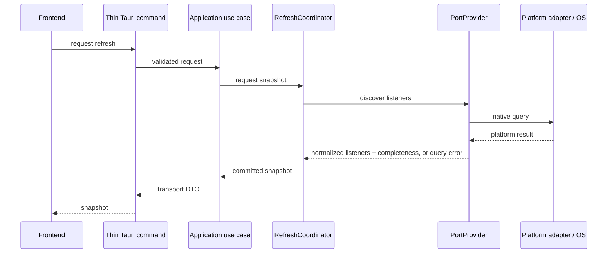

# Data Flow and Refresh Coordination

**Applies to:** `THAA-REQ-0.1` · **Status:** Initial architecture baseline

## Listener inspection



The application may enrich resolved listener owners through `ProcessProvider`, retaining unavailable metadata rather than failing the whole snapshot. Search/filter is a frontend view operation over returned listener/process presentation data and does not change process state.

W010 defines the platform-neutral `ProcessProvider::inspect(ProcessId)` contract. A successful query returns W006 `ProcessInfo`, including explicit per-field availability; a missing process or detected disappearance during inspection is a stable query-level error. The provider returns one process only, does not enumerate processes, and does not perform identity authorization or actions. The application combines port ownership PIDs with process metadata later; neither port provider performs process enrichment. Platform-wide capabilities remain separate from per-process metadata.

W011 adds the application-layer `inspect_processes` flow for arbitrary
caller-supplied process IDs. It removes duplicate IDs while retaining
first-seen order, calls W010 once per distinct ID, and returns a result for
every ID. Errors do not abort later inspections because W010 does not encode
whether an error is provider-wide; a successful response with a mismatched PID
is converted to a per-ID `ProviderFailure`. This flow has no persistent cache
and is callable by later snapshot orchestration without owning refresh policy.

W011.1 implements the first native `ProcessProvider` in the macOS adapter.
It validates process presence and start-time evidence around a bounded `lsof`
metadata query. Name and working directory are reported when the utility
returns unambiguous values; executable path and structured arguments are
unavailable rather than inferred. No private Apple API is used. W011 remains
unchanged and can invoke this provider without Tauri or frontend coupling.

W011.2 implements the Windows provider with one limited-information process
handle per requested PID. A verified executable image path, its file-stem
name, and creation time are normalized into W006 values; structured arguments
and working directory remain explicitly unavailable. Zero-timeout process
object checks before and after queries report a process that exits during
inspection as `ProcessDisappeared`. The handle is closed before returning and
is not stored in shared state. W011 and the W010 contract remain unchanged.

W013 composes one `RuntimeInspector` at startup for the active platform. Each
refresh calls `PortProvider` once, passes unique listener owner PIDs through
W011, and retains unknown ownership and process-level errors on their
listener rows. Partial port scans produce usable partial snapshots; a
query-level port failure leaves the last successful snapshot available with a
safe error state. The snapshot includes capability values and opaque
snapshot-scoped listener/action references. It contains no reusable native
handle and frontend display paths are not round-tripped as action identity.

Manual refresh and the visible-window ten-second timer request refresh through
the same non-overlapping coordinator. Concurrent calls coalesce to the latest
generation and a superseded generation cannot replace the accepted snapshot.
The compact tray menu is a projection of that same snapshot; tray activation
requests refresh rather than starting a second scan path. Automatic scanning
while hidden is not implemented.

W012.0 defines identity-bound process action values and the
`ProcessController` and `PlatformCapabilitiesProvider` ports. Action targets
require a positive PID and observed start time; platform adapters must
revalidate identity immediately before acting. `Requested` reports request
acceptance, not confirmed exit. No controller or destructive operation is
implemented in W012.0.

For `PortProvider`, a complete empty result means a successful query with no
listeners; a partial result carries a failure category; a query-level error is
not converted to an empty list. The provider contract is synchronous, so the
future coordinator runs it on a blocking worker and does not overlap scans.
Cancellation stays at orchestration level and cannot start replacement work
until the prior call settles.

W008 implements the macOS adapter with one bounded, direct `/usr/sbin/lsof`
invocation and a private machine-field parser. W009 implements the Windows
adapter with bounded `GetExtendedTcpTable` queries for IPv4 and IPv6 owner-PID
listener rows. Both return normalized W006 listeners through the same W007
contract; neither is currently invoked by a Tauri command or UI. W009's
Windows behavior is validated on the native hosted Windows runner. These
providers establish listener-discovery infrastructure, not the user-facing
Port Monitoring feature.

## Safe process stop

```mermaid
sequenceDiagram
  participant UI as Frontend
  participant Cmd as Tauri command
  participant UC as Stop use case
  participant Ctrl as ProcessController
  participant Cap as PlatformCapabilitiesProvider
  UI->>Cap: read platform capabilities
  Cap-->>UI: supported actions
  UI->>UI: expose only supported actions
  UI->>UI: confirm explicit action
  UI->>Cmd: action + observed identity
  Cmd->>Cmd: validate transport input
  Cmd->>UC: structured request
  UC->>Ctrl: explicit action + expected identity
  Ctrl->>Ctrl: resolve and compare current identity immediately before action
  Ctrl->>Ctrl: reject mismatch/insufficient confidence
  Ctrl->>Ctrl: perform native action
  Ctrl-->>UC: action result
  UC-->>Cmd: safe result category
  Cmd-->>UI: result; request fresh snapshot
```

Confirmation is a frontend usability gate, not a security boundary. The backend validates and revalidates because frontend input is untrusted. A race can remain between revalidation and the native operation; implementations must report the operation outcome and refresh rather than claiming a stronger guarantee.

Graceful Stop requests normal shutdown and is offered only when generic
platform capability supports it. Force Stop is separate, explicitly
confirmed, and offered only when supported. An unsupported graceful request
must return `Unsupported`; it must never be translated into forced
termination. Capability reporting does not guarantee per-target permission.

W012.1's macOS adapter implements the final native step only: it re-reads
precise start-time identity, compares it with the identity-bound target, then
issues exactly one positive-PID `kill(2)` request (`SIGTERM` for Graceful Stop
or `SIGKILL` for Force Stop). It returns `Requested` on acceptance and leaves
exit confirmation to later observation. The sysctl-to-signal PID race remains
documented. W012.2 implements Windows Force Stop only: it opens one process
HANDLE, revalidates required creation-time and originally observed executable
identity through that HANDLE, and calls `TerminateProcess` through the same
HANDLE. Windows Graceful Stop remains explicitly unsupported. Neither
controller waits for exit; a later fresh observation confirms it. The Windows
same-object HANDLE property avoids retargeting a reused PID during the action
sequence, while macOS retains its documented check-to-signal PID race.

W013 maps only opaque action-target references across IPC. The backend resolves
them against the most recently committed successful snapshot and dispatches
the explicit action through the capability-aware application boundary. A
successful action response means `Requested`; UI refresh is a later
observation and does not optimistically claim process exit. Force Stop requires
an explicit confirmation. Search/filter remains a view concern in W014.

## Refresh ownership and invariants

One application-level `RefreshCoordinator` owns the canonical scan state for all consumers, including the main window and tray. UI surfaces subscribe/request snapshots; they do not start independent scanners.

- At most one provider scan is active at any time.
- Manual refresh during an active scan records one pending latest refresh; repeated requests coalesce rather than form an unbounded queue.
- Automatic ticks during an active scan coalesce and never start overlapping work.
- A newer requested generation supersedes older results. An old result may not replace the canonical snapshot after a newer request was accepted.
- Run a pending scan only after the current scan has completed or cancellation has settled. Cancellation is best-effort and must not permit overlapping provider work.
- Keep the last committed snapshot available with freshness/loading/error status while the next scan runs; do not present stale data as newly verified.
- Provider work stays off the UI thread. Application shutdown cancels work where practical.

This establishes FR-004/NFR-005/006 invariants. Exact runtime primitives, polling cadence, backoff, and metrics are chosen during bootstrap/provider work based on the selected async/runtime model and measurements.

## Shared snapshot consumers

The coordinator publishes one committed snapshot and safe status to interested UI surfaces. It owns generation and in-flight state, not view rendering or per-window filter state. A tray view may use a compact projection of the same snapshot; it must not run duplicate port/process discovery.

## Traceability

These flows support FR-001–FR-006, FR-008–FR-011, NFR-003/005/006/008/009, and PR-004/005/006/009. Project context (FR-012/013) remains later P1 enrichment and is not inserted into the P0 scan path.
