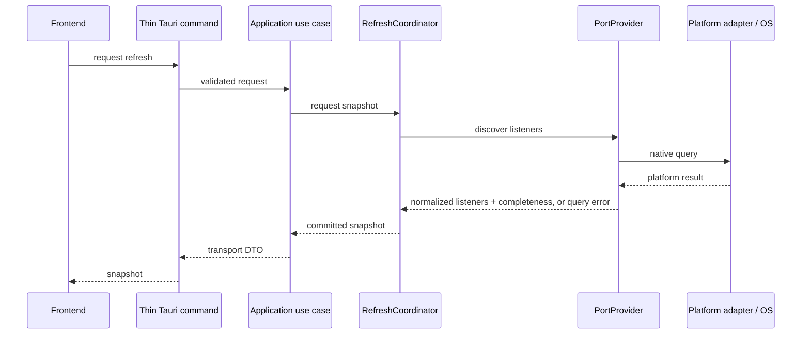

# Data Flow and Refresh Coordination

**Applies to:** `THAA-REQ-0.1` · **Status:** Initial architecture baseline

## Listener inspection



The application may enrich resolved listener owners through `ProcessProvider`, retaining unavailable metadata rather than failing the whole snapshot. Search/filter is a frontend view operation over returned listener/process presentation data and does not change process state.

For `PortProvider`, a complete empty result means a successful query with no
listeners; a partial result carries a failure category; a query-level error is
not converted to an empty list. The provider contract is synchronous, so the
future coordinator runs it on a blocking worker and does not overlap scans.
Cancellation stays at orchestration level and cannot start replacement work
until the prior call settles.

## Safe process stop

```mermaid
sequenceDiagram
  participant UI as Frontend
  participant Cmd as Tauri command
  participant UC as Stop use case
  participant Ctrl as ProcessController
  UI->>UI: confirm explicit action
  UI->>Cmd: action + observed identity
  Cmd->>Cmd: validate transport input
  Cmd->>UC: structured request
  UC->>Ctrl: explicit action + expected identity
  Ctrl->>Ctrl: resolve and compare current identity immediately before action
  Ctrl->>Ctrl: reject mismatch/insufficient confidence
  Ctrl->>Ctrl: perform native action
  Ctrl-->>UC: action result
  UC-->>Cmd: safe result category
  Cmd-->>UI: result; request fresh snapshot
```

Confirmation is a frontend usability gate, not a security boundary. The backend validates and revalidates because frontend input is untrusted. A race can remain between revalidation and the native operation; implementations must report the operation outcome and refresh rather than claiming a stronger guarantee.

## Refresh ownership and invariants

One application-level `RefreshCoordinator` owns the canonical scan state for all consumers, including the main window and tray. UI surfaces subscribe/request snapshots; they do not start independent scanners.

- At most one provider scan is active at any time.
- Manual refresh during an active scan records one pending latest refresh; repeated requests coalesce rather than form an unbounded queue.
- Automatic ticks during an active scan coalesce and never start overlapping work.
- A newer requested generation supersedes older results. An old result may not replace the canonical snapshot after a newer request was accepted.
- Run a pending scan only after the current scan has completed or cancellation has settled. Cancellation is best-effort and must not permit overlapping provider work.
- Keep the last committed snapshot available with freshness/loading/error status while the next scan runs; do not present stale data as newly verified.
- Provider work stays off the UI thread. Application shutdown cancels work where practical.

This establishes FR-004/NFR-005/006 invariants. Exact runtime primitives, polling cadence, backoff, and metrics are chosen during bootstrap/provider work based on the selected async/runtime model and measurements.

## Shared snapshot consumers

The coordinator publishes one committed snapshot and safe status to interested UI surfaces. It owns generation and in-flight state, not view rendering or per-window filter state. A tray view may use a compact projection of the same snapshot; it must not run duplicate port/process discovery.

## Traceability

These flows support FR-001–FR-006, FR-008–FR-011, NFR-003/005/006/008/009, and PR-004/005/006/009. Project context (FR-012/013) remains later P1 enrichment and is not inserted into the P0 scan path.
