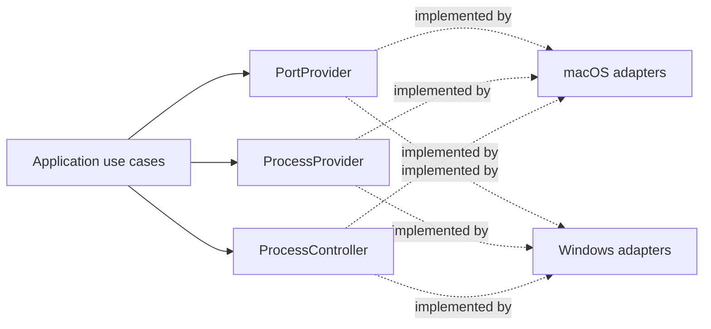

# Platform Adapters and Provider Contracts

**Applies to:** `THAA-REQ-0.1` · **Status:** Initial architecture baseline

## Boundary rule

The application calls platform-neutral provider ports. Concrete implementations live in `platform/macos` and `platform/windows`; platform selection occurs once at the startup composition root. Keep native types, subprocess formats, parsing, and `cfg(target_os = ...)` branches inside those modules/composition. Shared domain/application code has no OS-specific dependencies or broad OS conditionals.

## `PortProvider`

Responsibility: return a normalized snapshot of listening TCP endpoints, including local IPv4/IPv6 address, port, and ownership when resolvable.

- Input: no user-controlled command text; accept cancellation/deadline context when the implementation's runtime supports it.
- Output: normalized listener values and explicit unresolved ownership; never leak raw command output to application/domain code.
- Errors: distinguish permission denial, provider/OS failure, and parse failure. Per-listener unresolved owner is data, not a whole-scan failure. Partial results must carry a bounded diagnostic category if the native source can return both rows and failures.
- Ownership mapping: include PID only when reported by the OS/provider; do not infer from port number or process name.
- Platform direction: macOS may initially isolate `lsof` invocation and parsing here, with fixed arguments, bounded execution, and a replacement path to native APIs. Windows should use a native networking API (the prompt points to IP Helper / `GetExtendedTcpTable`); PowerShell is not the permanent provider architecture.
- Safety: no shell interpolation, no arbitrary commands, no privilege escalation.

## `ProcessProvider`

Responsibility: inspect one process identity and return normalized metadata/capability outcomes. It does not select UI presentation or perform actions.

- Input: observed process identifier and identity evidence when available.
- Output: identity plus field-level metadata availability for name, executable path, command/arguments, working directory, and only other fields required by scheduled requirements.
- Errors: per-field permission/unsupported/inaccessible states remain field-level; a disappeared process and provider failure remain query-level semantic outcomes.
- Do not implement CPU/memory/uptime, process tree, project-root, or Git enrichment as part of P0 unless their requirement work is separately scheduled.

## `ProcessController`

Responsibility: perform an explicitly requested graceful stop or force stop for a revalidated process identity. It is separate from inspection so tests and permissions can distinguish read-only and destructive operations.

- Input includes the expected observed identity and one explicit action.
- `ProcessController` performs the authoritative identity revalidation inside the platform adapter immediately before the native call. It compares all available stable evidence (PID plus name/executable/start time where observable); a separate earlier `ProcessProvider` inspection is not sufficient authorization to act.
- Reject a mismatch, insufficient target confidence, unsupported action, or permission failure. Report process disappearance distinctly.
- Never match by name, target a group, or convert graceful-stop failure into implicit force stop. Force stop remains a separately confirmed request.
- Keep no avoidable asynchronous work between revalidation and the native action. If the OS does not offer an atomic compare-and-act operation, document that residual race, report the operation result, and require fresh inspection rather than claiming certainty about later state.

## Capability reporting

Expose only current/near-term P0-relevant support: command-line, working directory, parent process (near-term P1), graceful stop, and force stop. Keep platform-wide support distinct from per-process permission/result. Frontend presentation uses the returned capability/outcome to disable or explain actions; the backend remains authoritative and revalidates every request.

## Contract testability

Each provider port must be replaceable by a deterministic fake for application tests. Define equivalent behavioral contract suites for macOS and Windows implementations:

- A controlled random-port TCP listener appears while bound and disappears after close; protocol/address/port normalize correctly.
- Ownership resolves when the native provider exposes it and remains explicitly unresolved when it does not.
- Controlled processes return PID/name and supported metadata; unavailable fields retain explicit reasons.
- Stop/action contracts report unsupported, denied, disappeared, rejected, and completed outcomes without unsafe fallback.
- IPv4 and IPv6 cases run where the native environment supports them; environment limitations are reported, not silently treated as passes.

These native contracts are future implementation validation, not W003 tests. Compilation alone does not establish cross-platform behavior. Architecture supports FR-001/002/006/008/009 and NFR-002/003/005/008/009 without claiming implementation.
