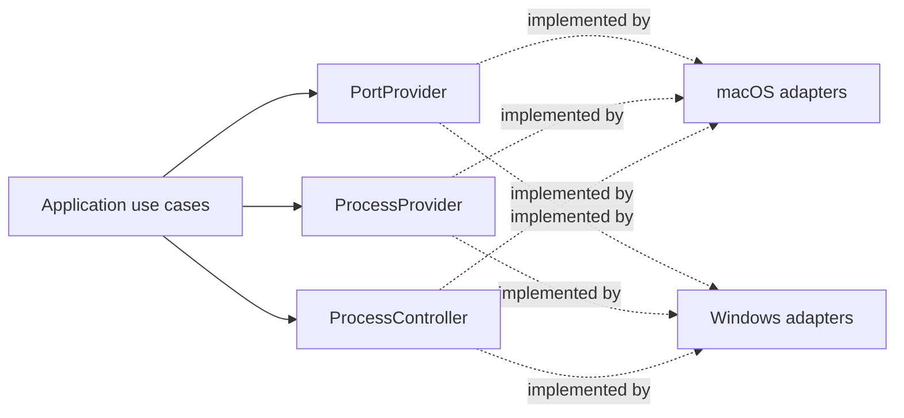

# Platform Adapters and Provider Contracts

**Applies to:** `THAA-REQ-0.1` · **Status:** Initial architecture baseline

## Boundary rule

The application calls platform-neutral provider ports. Concrete implementations live in `platform/macos` and `platform/windows`; platform selection occurs once at the startup composition root. Keep native types, subprocess formats, parsing, and `cfg(target_os = ...)` branches inside those modules/composition. Shared domain/application code has no OS-specific dependencies or broad OS conditionals.

## `PortProvider`

Responsibility: return a normalized snapshot of listening TCP endpoints, including local IPv4/IPv6 address, port, and ownership when resolvable. The shared contract is defined in `domain::port_provider`, consistent with W003's rule that stable provider ports belong to the inward-facing domain boundary.

- Contract: synchronous, object-safe `PortProvider::listeners(&self)` returns `Result<PortScanResult, PortProviderError>`. It is `Send + Sync` for shared ownership by the future refresh coordinator and dispatch to a blocking worker. The provider contract does not bind callers to an async runtime.
- Output: `PortScanResult` contains W006 `NetworkListener` values and `PortScanCompleteness`. A complete empty result means the query succeeded and found no listeners. Partial results retain usable rows and a bounded failure category; they must not be presented as complete. `Err` means a usable scan could not be returned.
- Errors: stable categories distinguish permission denial, unsupported operation, unavailable mechanism, parse failure, operating-system failure, and provider failure. Per-listener unresolved owner remains successful data. Do not leak raw command/API output, native error codes, or secrets through this boundary.
- Concurrency and cancellation: application refresh coordination invokes blocking implementations away from the UI thread, prevents overlap, and waits for in-flight work to settle. Cancellation stays above this synchronous contract; a future adapter bounds its own operation where possible. No cancellation-token abstraction is introduced in W007.
- Ordering and duplicates: result order is unspecified; consumers sort for presentation. Preserve semantically distinct endpoints, including same-port records with different addresses or ownership. Providers may coalesce only fully identical normalized rows.
- Ownership mapping: include PID only when reported by the OS/provider; do not infer from port number or process name.
- Platform direction: macOS may initially isolate `lsof` invocation and parsing here, with fixed arguments, bounded execution, and a replacement path to native APIs. Windows should use a native networking API (the prompt points to IP Helper / `GetExtendedTcpTable`); PowerShell is not the permanent provider architecture.
- Safety: no shell interpolation, no arbitrary commands, no privilege escalation.

### macOS implementation evidence (W008)

`platform::macos::port_provider::MacOSPortProvider` implements the shared
contract using `/usr/sbin/lsof`. The executable path is the macOS system
location verified on the W008 host; the provider does not search user-writable
directories or depend on a GUI process `PATH`. It clears inherited environment
variables and sets `LC_ALL=C`. One direct `Command` invocation uses static
arguments `-nP -F0pftPn -a -iTCP -sTCP:LISTEN`: numeric address/port output,
NUL field terminators, only the required fields, ANDed TCP/listening filters.
The output parser is private to the macOS adapter and converts records to W006
values before returning them. No shell, `sudo`, repeat mode, or native FFI is
used.

The provider bounds execution to 30 seconds and combined captured stdout/stderr
to 16 MiB. It treats exit status 1 with empty stdout and stderr as the verified
no-match result on the W008 host; nonzero results with usable rows become
partial results, and malformed required records fail parsing rather than being
silently dropped. Scoped IPv6 addresses cannot fit the W006 `IpAddr` model, so
their listener is retained with unknown address and the scan is marked partial
with `Unsupported`. This is an explicit model limitation, not an Internet
reachability claim. User-level `lsof` visibility remains subject to macOS
permissions. The contract can later be implemented using Darwin APIs without
changing callers.

W008 verified this behavior on macOS 27.0 arm64 with system `lsof` 4.91.
Controlled IPv4 loopback, IPv4 wildcard, IPv6 loopback, and IPv6 wildcard
listeners were discovered, with PID ownership checked for the IPv4 loopback
test. This is macOS-only evidence.

### Windows implementation evidence (W009)

`platform::windows::port_provider::WindowsPortProvider` implements the same
contract with Microsoft's `GetExtendedTcpTable`, using
`TCP_TABLE_OWNER_PID_LISTENER` separately for `AF_INET` and `AF_INET6`. Its
Windows-only `windows-sys` dependency enables Foundation, IpHelper, WinSock,
and the narrowly scoped System Threading APIs used by the separate process
adapter. The listener provider itself does not use PowerShell, `netstat`,
shell execution, or process metadata APIs.

The native buffer uses initialized, `u64`-aligned storage capped at 16 MiB.
The provider validates sizing results, retries `ERROR_INSUFFICIENT_BUFFER` at
most three times after the sizing call, and validates table entry counts and
row extents before reading any field. The unsafe boundary is limited to the
documented API calls and a bounded byte-slice view; parsing and normalization
use checked safe byte access. API error codes map to stable W007 categories.

IPv4 addresses are interpreted from their in-memory network bytes; TCP ports
are converted from network byte order. IPv6 addresses use the API's 16-byte
array. A nonzero IPv6 scope ID cannot be represented by W006 `IpAddr`, so the
listener remains present with an unknown address and an explicit partial
`Unsupported` result, consistent with W008. The API-reported PID is preserved,
including zero, because W006 defines no PID sentinel. A successful empty pair
of tables is a complete empty result. If one address-family query fails, rows
from the other family are preserved as partial; if both fail, the IPv4 error
is returned deterministically.

W009's controlled native tests run in the existing GitHub-hosted
`windows-2025` job and cover IPv4/IPv6 loopback and wildcard listeners, PID
ownership, and post-close disappearance. This provider remains replaceable
without changing the shared `PortProvider` or domain types.

### Windows process implementation evidence (W011.2)

`platform::windows::process_provider::WindowsProcessProvider` implements the
same W010 contract. It opens one process handle with
`PROCESS_QUERY_LIMITED_INFORMATION | PROCESS_SYNCHRONIZE`, uses it for
`QueryFullProcessImageNameW`, `GetProcessTimes`, and nonblocking process-object
state checks, then closes it through a Windows-only RAII wrapper. The handle
anchors returned fields to one process object for that inspection; it is
never retained in shared state. The process name is the file stem of the
verified image path. Start time is normalized from the documented 1601-UTC
FILETIME epoch. Structured arguments and working directory remain
`Unavailable(ProviderLimitation)`: a command-line string does not establish
target argv boundaries, and no supported public arbitrary-process current
directory query was selected. PID zero is the System Idle Process and is
reported `Unsupported`; access-denied open failures remain `PermissionDenied`.

The Windows-only Microsoft `windows-sys` 0.61.2 binding adds only the
`Win32_System_Threading` feature. The native controlled-child test validates
image path, basename, creation time, unsupported-field availability, W010
contract behavior, W011 orchestration, and post-exit disappearance. Its child
is the integration-test executable; it does not inspect unrelated runner
processes. This provider does not enumerate processes, inspect remote memory,
request elevation, or perform process actions. The current application has no
capability-provider/composition API, so W011.2 records per-field availability
without adding unused global capability reporting.

## `ProcessProvider`

Responsibility: inspect one process identifier and return normalized process metadata. Platform-wide capabilities and process-action outcomes remain separate. It does not select UI presentation or perform actions.

- Contract: synchronous, object-safe `ProcessProvider::inspect(ProcessId)` returns `Result<ProcessInfo, ProcessProviderError>` and is `Send + Sync`, matching W007's provider composition convention.
- Input: one observed `ProcessId`; process names are never lookup keys.
- Output: W006 `ProcessInfo`, whose identity PID must match the requested PID and whose name, executable path, start time, command arguments, and working directory preserve field-level availability.
- Errors: a missing process or detected exit during inspection is `ProcessDisappeared`. Per-field permission/unsupported/inaccessible states remain successful field availability while process existence is established; whole-query denial and provider/OS failures are operation errors.
- PID is a lookup key, not durable process identity. Returned identity evidence can support later reasoning, but equality is not authorization for a destructive action.
- Platform-wide `PlatformCapabilities` is separate from this per-process result. W010 adds no capability query or action support to `ProcessProvider`.
- Do not implement CPU/memory/uptime, process tree, project-root, or Git enrichment as part of P0 unless their requirement work is separately scheduled.

W011.1 adds `MacOSProcessProvider` behind this contract. W012.0 replaces its
second-resolution `/bin/ps lstart` snapshot identity with a narrow
`sysctl(KERN_PROC_PID)` query compiled against the active macOS SDK's
`kinfo_proc` definition. The query validates returned size and PID, rejects
zombie records, and reads `p_starttime` at timeval precision before and after
the bounded `lsof` metadata query. `lsof` supplies the command name and
working directory. Executable path and structured argv remain unavailable;
the provider does not use private `libproc` APIs or reconstruct argv from
display text. Apple documents `sysctl` process-table selectors in its
[sysctl manual](https://developer.apple.com/library/archive/documentation/System/Conceptual/ManPages_iPhoneOS/man3/sysctlnametomib.3.html).

The native integration fixture is a test-owned `/bin/sleep` child, not a GUI
application. The provider is read-only, requests no elevation, clears inherited
environment variables for subprocesses, bounds time/output, and does not
expose raw utility output. `/usr/sbin/lsof` is a standard system utility and
the identity query uses the documented BSD `sysctl` interface, but this
mechanism's App Sandbox / Mac App Store suitability has
not been established; the distribution channel remains a product decision.

## `ProcessController`

Responsibility: perform an explicitly requested graceful stop or force stop for a revalidated process identity. It is separate from inspection so tests and permissions can distinguish read-only and destructive operations.

- Input is a `ProcessActionTarget` created from an observed `ProcessIdentity`, plus one explicit `ProcessAction`. The target requires a positive PID and available start time; it carries an executable path when observed. PID zero cannot be represented as an action target.
- `ProcessController` performs authoritative, fresh identity revalidation inside the platform adapter immediately before the native call. Compare PID and start time, plus executable path when it was in the observed target. Process name, command arguments, and working directory are not authorization evidence.
- Reject a mismatch, missing revalidation evidence, unsupported action, or permission failure. Report an already-exited target distinctly.
- Never match by name, target a group, or convert graceful-stop failure into implicit force stop. Force stop remains a separately confirmed request.
- Action availability is capability-gated: macOS reports generic Graceful Stop and Force Stop support; Windows reports generic Graceful Stop unsupported and Force Stop supported. Unsupported Graceful Stop returns `Unsupported`; it never invokes force termination. Capability support is not a per-target permission guarantee.
- The result `Requested` means the OS accepted a request and does not assert that the process exited. A later fresh inspection confirms state; the controller does not wait or automatically escalate.
- Windows force-stop must revalidate and act through the same process handle. macOS positive-PID signals require a fresh identity read, but the check-to-signal PID reuse race remains residual. macOS `kill(2)` treats PID zero as the caller's process group, which is why action targets require a positive PID.

### macOS implementation evidence (W012.1)

`platform::macos::MacOSProcessController` implements the W012.0 contract.
It reuses the same SDK-backed `sysctl(KERN_PROC_PID)` start-time helper as
`MacOSProcessProvider`, validates the observed PID/start time, and then calls
the existing macOS C shim with a fixed action selector. The shim maps graceful
to `SIGTERM`, force to `SIGKILL`, rejects nonpositive PIDs, captures `errno`
immediately after a failed `kill(2)`, and returns bounded status codes. Rust
maps `ESRCH` to `AlreadyExited`, `EPERM` to `PermissionDenied`, and `EINVAL`
or other native errors to `OperatingSystemFailure`. It does not wait, retry,
escalate, or claim that an accepted request means the process has exited.

The fresh identity query and signal call remain separate PID-based operations.
The controller performs no unrelated query or logging between comparison and
signal delivery, but the narrow check-to-signal PID reuse race remains. It
cannot revalidate an executable path; if a target carries one, shared target
validation fails closed because the macOS provider does not supply that field.
The controller and capability provider are implemented but are not composed
into a Tauri command or user interface. Hosted macOS native action tests are
required before W012.1 is complete.

## Capability reporting

`domain::capabilities::PlatformCapabilitiesProvider` returns the existing
`PlatformCapabilities` value. Support means a platform has a safe general
mechanism, not that every process can be inspected or acted on. W012.0.1
requirements: macOS graceful/force mechanisms are supported; Windows graceful
stop is unsupported for arbitrary discovered runtimes, while force stop is
supported subject to rights and same-handle revalidation. Per-target permission
and identity outcomes remain authoritative. The interfaces exist, but no
Windows controller remains unimplemented. W012.1 adds
`MacOSPlatformCapabilitiesProvider`: command-line support is Unsupported,
working-directory, graceful-stop, and force-stop support are Supported. These
are platform-level capabilities, not per-process guarantees.

## Contract testability

Each provider port must be replaceable by a deterministic fake for application tests. Define equivalent behavioral contract suites for macOS and Windows implementations:

- A controlled random-port TCP listener appears while bound and disappears after close; protocol/address/port normalize correctly.
- Ownership resolves when the native provider exposes it and remains explicitly unresolved when it does not.
- Controlled processes return PID/name and supported metadata; unavailable fields retain explicit reasons.
- Stop/action contracts report unsupported, denied, disappeared, rejected, and completed outcomes without unsafe fallback.
- IPv4 and IPv6 cases run where the native environment supports them; environment limitations are reported, not silently treated as passes.

These native contracts are future implementation validation, not W003 tests. Compilation alone does not establish cross-platform behavior. Architecture supports FR-001/002/006/008/009 and NFR-002/003/005/008/009 without claiming implementation.
