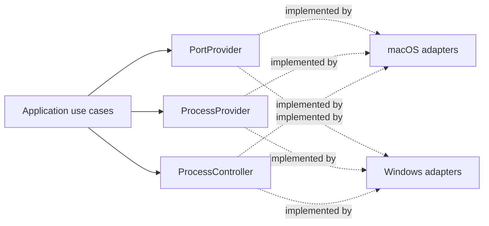

# Platform Adapters and Provider Contracts

**Applies to:** `THAA-REQ-0.1` · **Status:** Initial architecture baseline

## Boundary rule

The application calls platform-neutral provider ports. Concrete implementations live in `platform/macos` and `platform/windows`; platform selection occurs once at the startup composition root. Keep native types, subprocess formats, parsing, and `cfg(target_os = ...)` branches inside those modules/composition. Shared domain/application code has no OS-specific dependencies or broad OS conditionals.

## `PortProvider`

Responsibility: return a normalized snapshot of listening TCP endpoints, including local IPv4/IPv6 address, port, and ownership when resolvable. The shared contract is defined in `domain::port_provider`, consistent with W003's rule that stable provider ports belong to the inward-facing domain boundary.

- Contract: synchronous, object-safe `PortProvider::listeners(&self)` returns `Result<PortScanResult, PortProviderError>`. It is `Send + Sync` for shared ownership by the future refresh coordinator and dispatch to a blocking worker. The provider contract does not bind callers to an async runtime.
- Output: `PortScanResult` contains W006 `NetworkListener` values and `PortScanCompleteness`. A complete empty result means the query succeeded and found no listeners. Partial results retain usable rows and a bounded failure category; they must not be presented as complete. `Err` means a usable scan could not be returned.
- Errors: stable categories distinguish permission denial, unsupported operation, unavailable mechanism, parse failure, operating-system failure, and provider failure. Per-listener unresolved owner remains successful data. Do not leak raw command/API output, native error codes, or secrets through this boundary.
- Concurrency and cancellation: application refresh coordination invokes blocking implementations away from the UI thread, prevents overlap, and waits for in-flight work to settle. Cancellation stays above this synchronous contract; a future adapter bounds its own operation where possible. No cancellation-token abstraction is introduced in W007.
- Ordering and duplicates: result order is unspecified; consumers sort for presentation. Preserve semantically distinct endpoints, including same-port records with different addresses or ownership. Providers may coalesce only fully identical normalized rows.
- Ownership mapping: include PID only when reported by the OS/provider; do not infer from port number or process name.
- Platform direction: macOS may initially isolate `lsof` invocation and parsing here, with fixed arguments, bounded execution, and a replacement path to native APIs. Windows should use a native networking API (the prompt points to IP Helper / `GetExtendedTcpTable`); PowerShell is not the permanent provider architecture.
- Safety: no shell interpolation, no arbitrary commands, no privilege escalation.

### macOS implementation evidence (W008)

`platform::macos::port_provider::MacOSPortProvider` implements the shared
contract using `/usr/sbin/lsof`. The executable path is the macOS system
location verified on the W008 host; the provider does not search user-writable
directories or depend on a GUI process `PATH`. It clears inherited environment
variables and sets `LC_ALL=C`. One direct `Command` invocation uses static
arguments `-nP -F0pftPn -a -iTCP -sTCP:LISTEN`: numeric address/port output,
NUL field terminators, only the required fields, ANDed TCP/listening filters.
The output parser is private to the macOS adapter and converts records to W006
values before returning them. No shell, `sudo`, repeat mode, or native FFI is
used.

The provider bounds execution to 30 seconds and combined captured stdout/stderr
to 16 MiB. It treats exit status 1 with empty stdout and stderr as the verified
no-match result on the W008 host; nonzero results with usable rows become
partial results, and malformed required records fail parsing rather than being
silently dropped. Scoped IPv6 addresses cannot fit the W006 `IpAddr` model, so
their listener is retained with unknown address and the scan is marked partial
with `Unsupported`. This is an explicit model limitation, not an Internet
reachability claim. User-level `lsof` visibility remains subject to macOS
permissions. The contract can later be implemented using Darwin APIs without
changing callers.

W008 verified this behavior on macOS 27.0 arm64 with system `lsof` 4.91.
Controlled IPv4 loopback, IPv4 wildcard, IPv6 loopback, and IPv6 wildcard
listeners were discovered, with PID ownership checked for the IPv4 loopback
test. This is macOS-only evidence.

### Windows implementation evidence (W009)

`platform::windows::port_provider::WindowsPortProvider` implements the same
contract with Microsoft's `GetExtendedTcpTable`, using
`TCP_TABLE_OWNER_PID_LISTENER` separately for `AF_INET` and `AF_INET6`. Its
Windows-only `windows-sys` dependency is limited to Foundation, IpHelper, and
WinSock APIs. The provider does not use PowerShell, `netstat`, shell execution,
or process metadata APIs.

The native buffer uses initialized, `u64`-aligned storage capped at 16 MiB.
The provider validates sizing results, retries `ERROR_INSUFFICIENT_BUFFER` at
most three times after the sizing call, and validates table entry counts and
row extents before reading any field. The unsafe boundary is limited to the
documented API calls and a bounded byte-slice view; parsing and normalization
use checked safe byte access. API error codes map to stable W007 categories.

IPv4 addresses are interpreted from their in-memory network bytes; TCP ports
are converted from network byte order. IPv6 addresses use the API's 16-byte
array. A nonzero IPv6 scope ID cannot be represented by W006 `IpAddr`, so the
listener remains present with an unknown address and an explicit partial
`Unsupported` result, consistent with W008. The API-reported PID is preserved,
including zero, because W006 defines no PID sentinel. A successful empty pair
of tables is a complete empty result. If one address-family query fails, rows
from the other family are preserved as partial; if both fail, the IPv4 error
is returned deterministically.

W009's controlled native tests run in the existing GitHub-hosted
`windows-2025` job and cover IPv4/IPv6 loopback and wildcard listeners, PID
ownership, and post-close disappearance. This provider remains replaceable
without changing the shared `PortProvider` or domain types.

## `ProcessProvider`

Responsibility: inspect one process identity and return normalized metadata/capability outcomes. It does not select UI presentation or perform actions.

- Input: observed process identifier and identity evidence when available.
- Output: identity plus field-level metadata availability for name, executable path, command/arguments, working directory, and only other fields required by scheduled requirements.
- Errors: per-field permission/unsupported/inaccessible states remain field-level; a disappeared process and provider failure remain query-level semantic outcomes.
- Do not implement CPU/memory/uptime, process tree, project-root, or Git enrichment as part of P0 unless their requirement work is separately scheduled.

## `ProcessController`

Responsibility: perform an explicitly requested graceful stop or force stop for a revalidated process identity. It is separate from inspection so tests and permissions can distinguish read-only and destructive operations.

- Input includes the expected observed identity and one explicit action.
- `ProcessController` performs the authoritative identity revalidation inside the platform adapter immediately before the native call. It compares all available stable evidence (PID plus name/executable/start time where observable); a separate earlier `ProcessProvider` inspection is not sufficient authorization to act.
- Reject a mismatch, insufficient target confidence, unsupported action, or permission failure. Report process disappearance distinctly.
- Never match by name, target a group, or convert graceful-stop failure into implicit force stop. Force stop remains a separately confirmed request.
- Keep no avoidable asynchronous work between revalidation and the native action. If the OS does not offer an atomic compare-and-act operation, document that residual race, report the operation result, and require fresh inspection rather than claiming certainty about later state.

## Capability reporting

Expose only current/near-term P0-relevant support: command-line, working directory, parent process (near-term P1), graceful stop, and force stop. Keep platform-wide support distinct from per-process permission/result. Frontend presentation uses the returned capability/outcome to disable or explain actions; the backend remains authoritative and revalidates every request.

## Contract testability

Each provider port must be replaceable by a deterministic fake for application tests. Define equivalent behavioral contract suites for macOS and Windows implementations:

- A controlled random-port TCP listener appears while bound and disappears after close; protocol/address/port normalize correctly.
- Ownership resolves when the native provider exposes it and remains explicitly unresolved when it does not.
- Controlled processes return PID/name and supported metadata; unavailable fields retain explicit reasons.
- Stop/action contracts report unsupported, denied, disappeared, rejected, and completed outcomes without unsafe fallback.
- IPv4 and IPv6 cases run where the native environment supports them; environment limitations are reported, not silently treated as passes.

These native contracts are future implementation validation, not W003 tests. Compilation alone does not establish cross-platform behavior. Architecture supports FR-001/002/006/008/009 and NFR-002/003/005/008/009 without claiming implementation.
