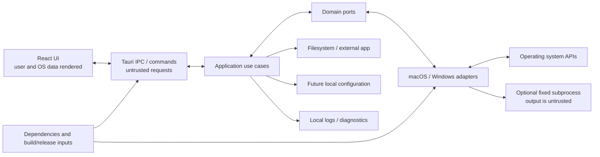

# Thaa Threat Model

**Applies to:** `THAA-REQ-0.1` and the W003 architecture baseline · **Status:** Initial design-time model

This model records realistic threats for a local desktop utility that observes process/network state and may later stop processes. It is a design baseline, not evidence that mitigations are implemented. Revisit entries when a security-triggering work item changes an asset, boundary, or mitigation. Use [Engineering Security Baseline](SECURITY.md) for normative implementation rules.

## Assets

- **User/system safety:** correct process identity, safe destructive target, action integrity, OS stability, and user data.
- **Sensitive local information:** process names, command arguments, executable and working-directory paths, project/repository context, listener addresses/ports, diagnostics, and screenshots.
- **Application integrity:** configuration when introduced, native API/FFI boundary, dependency graph, packaged binary, and future update/release artifacts.
- **User trust:** accurate metadata availability, warnings, exposure language, and process-action results; absence of hidden collection or telemetry.

## Trust boundaries

All values crossing these boundaries are untrusted or may become stale. In particular, IPC is not trusted solely because it normally originates from the bundled UI; native return values and subprocess output require validation; paths and command lines can be malicious or secret-bearing.

## Threat register

Likelihood and impact are qualitative design-time estimates. Every mitigation and verification below is required before the corresponding feature is considered complete. Residual risk is stated honestly; “Not implemented” means W004 defines a future control only.

### THR-001 — Hostile or excessive process metadata

- **Asset / boundary:** UI integrity and sensitive local information; OS/provider → domain → Tauri/frontend/logs.
- **Scenario:** A process name/argument contains control characters, terminal escapes, markup, misleading Unicode, or an extremely long value; UI/logging interprets it or becomes unusable.
- **Impact / likelihood:** Medium / Medium.
- **Mitigation:** Treat all metadata as plain untrusted text; normalize/bound at adapter or DTO edge, escape at presentation, neutralize control sequences, show explicit truncation, and avoid echoing values in errors.
- **Verification:** Security fixtures for control characters, quotes, Unicode, markup, and long values; manual UI/screenshot review when UI exists; log-output checks.
- **Residual risk:** Unicode spoofing can remain confusing; present context and preserve raw data only where user inspection requires it.
- **References / status:** FR-006/011; NFR-003/004; PR-004/007; W003 domain/Tauri boundaries; TC-SEC-001. **Not implemented.**

### THR-002 — Shell or argument injection

- **Asset / boundary:** OS integrity; untrusted process/PID/path/address → platform adapter/subprocess.
- **Scenario:** A process-controlled string or frontend value is interpolated into shell syntax, causing an unintended command or argument.
- **Impact / likelihood:** High / Medium.
- **Mitigation:** Prefer native APIs. Where subprocess use is necessary, execute a fixed binary with structured argument arrays, fixed options, bounded execution/output, and no shell; never execute observed metadata or project code.
- **Verification:** Code review for all subprocess creation; adversarial metacharacter/quote/space fixtures; assert arguments remain discrete and no project-controlled executable is run.
- **Residual risk:** A fixed utility may have its own parsing/platform behavior; isolate parser and validate outputs.
- **References / status:** NFR-003; PR-007; W003 platform adapter boundary; TC-SEC-002. **Not implemented.**

### THR-003 — PID reuse or name-only targeting

- **Asset / boundary:** User/system safety; stale displayed identity → `ProcessController`.
- **Scenario:** A process exits and its PID is reused before a stop; a name-only operation affects unrelated or multiple processes.
- **Impact / likelihood:** Critical / Medium.
- **Mitigation:** One identity-bound `ProcessActionTarget` only; require positive PID and platform-required start-time evidence, plus executable path when it was observed; revalidate inside `ProcessController` immediately before action; reject mismatch or missing evidence. Name, arguments, and working directory are not identity evidence. Expose only supported actions. Graceful Stop requests normal shutdown; Force Stop is separate and confirmed, never an automatic substitute or escalation.
- **Verification:** Deterministic identity/action mapping tests and controlled child-process integration tests for matching identity, mismatch refusal, SIGTERM, SIGKILL, and disappearance. W012.1 passed local macOS 27 arm64 and hosted macOS 15 arm64 PR CI. W012.2 controlled Windows tests passed on hosted `windows-2025` PR #31 run 37123555206, including both identity mismatch refusals with child survival.
- **Residual risk:** PID reuse can occur in the narrow interval after macOS revalidation and before `kill(2)` because the action is PID-based. The controller minimizes but does not eliminate this race.
- **References / status:** FR-008/009; NFR-003/005; PR-005/006; W003 ADR-003 and `ProcessController`; TC-ACTION-001/002/003. **macOS graceful/force implemented; Windows force implementation is W012.2 and generic graceful remains unsupported.**

### THR-004 — Scan-to-action race or stale ownership

- **Asset / boundary:** Action integrity and truthful UI; provider snapshot → user confirmation → action.
- **Scenario:** Listener closes, ownership changes, metadata changes, or the target disappears after scan but before action; stale UI is treated as authoritative.
- **Impact / likelihood:** High / Medium.
- **Mitigation:** Treat snapshots as observations, not authorization. Revalidate required target identity inside `ProcessController` immediately before action; report disappearance/mismatch/permission/unsupported errors distinctly; refresh afterward. Never infer current state from an old snapshot. A successful request is not confirmed exit.
- **Verification:** Deterministic race fixtures for close/ownership change/process exit and stale refresh generation; safe native integration only with controlled children/listeners.
- **Residual risk:** OS changes may still race after revalidation; action outcome may not describe later state.
- **References / status:** FR-004/008/009/011; NFR-005/006; PR-005; W003 ADR-003/004; TC-ACTION-004, TC-REFRESH-001/002. **W012.1 covers macOS controlled action/disappearance; W012.2 covers Windows same-HANDLE force action; refresh remains unimplemented.**

### THR-005 — Protected/system process action or permission failure

- **Asset / boundary:** OS stability and user trust; adapter → OS action APIs.
- **Scenario:** User selects a protected/system process or inspection/stop is denied; code retries, misreports success, or destabilizes the OS.
- **Impact / likelihood:** High / Low-to-Medium.
- **Mitigation:** Do not target known critical OS processes; expose capability/permission outcomes; do not retry with broader rights; no automatic elevation; distinguish requested, rejected, denied, disappeared, and later-observed exit outcomes. Windows generic graceful stop is unsupported under the current model; never substitute force termination.
- **Verification:** Deterministic native-result mapping covers permission denial without targeting protected/system processes. W013 presents action outcomes and performs no elevation; interactive UI validation remains pending.
- **Residual risk:** Platform protection signals differ and may be incomplete; unknown targets still require identity checks and explicit confirmation.
- **References / status:** FR-008/009/011; NFR-002/005; PR-005/006; TC-PROC-002, TC-ACTION-004. **macOS and Windows controller mappings are platform-specific; W013 capability-gates user-facing actions; Windows generic graceful stop remains unsupported. Interactive validation is pending.**

### THR-006 — Silent privilege escalation

- **Asset / boundary:** User/system control; app process → OS privilege boundary.
- **Scenario:** Installer, helper, subprocess, or API silently requests administrator/root access or retries denied operations with elevated privileges.
- **Impact / likelihood:** High / Low.
- **Mitigation:** Ordinary inspection uses least privilege; never prompt/elevate automatically. Any future privileged operation requires an explicit requirement, explanation, consent, dedicated security review, and separate design.
- **Verification:** Inspect manifests, launch configuration, helper/service code, and action paths; verify permission-denied tests degrade without elevation.
- **Residual risk:** Some OS metadata/actions remain unavailable under normal user permissions.
- **References / status:** NFR-002; PR-001/004/005; prompt §61; TC-SEC-010. **Not implemented.**

### THR-007 — Unsafe URL construction/opening

- **Asset / boundary:** User and external application safety; process/listener/IPC data → URL opener.
- **Scenario:** Arbitrary scheme/host, invalid port, malformed IPv6, or command-line text is opened as a URL or shell command.
- **Impact / likelihood:** High / Medium.
- **Mitigation:** Construct only expected local listener URLs from normalized address/port; validate scheme, address and port; format IPv6 correctly; use safe platform URL-opening API; never execute shell to open and never accept a raw process string as URL.
- **Verification:** Valid IPv4/IPv6 cases and rejection fixtures for invalid protocol/host/port, command-line text, and malformed input; ensure opener receives only validated URL objects/strings.
- **Residual risk:** Browser behavior and local service content remain outside Thaa's control; UI must not imply service safety.
- **References / status:** FR-007; NFR-003; PR-008; W003 Tauri boundary; TC-SEC-003. **Not implemented.**

### THR-008 — Unsafe filesystem or external-application opening

- **Asset / boundary:** User files and application launch; process/project path → file manager/terminal/editor.
- **Scenario:** An untrusted or deleted path, path with quotes/control characters, or symlink redirects a future reveal/open action or injects arguments.
- **Impact / likelihood:** High / Medium when feature exists.
- **Mitigation:** No implicit open. Require explicit user action; validate target and existence as appropriate; use platform APIs or structured argument arrays, never shell strings; define symlink behavior per feature before implementing; do not execute project files.
- **Verification:** Fixtures for spaces, quotes, unusual Unicode, deleted paths, and symlinks; assert no shell or arbitrary project execution. Add security review before FR-014 developer actions.
- **Residual risk:** Filesystem can change after validation; OS-specific file-manager behavior remains.
- **References / status:** NFR-003; PR-007/010; FR-014 is P1; TC-SEC-004. **Deferred; not implemented.**

### THR-009 — Unsafe native API/FFI use or resource leak

- **Asset / boundary:** Application and OS integrity; Rust adapter ↔ native API/FFI.
- **Scenario:** Invalid lengths/pointers/status values, lifetime errors, incorrect handle ownership, or missing cleanup cause crash, corruption, leak, or wrong process action.
- **Impact / likelihood:** High / Medium.
- **Mitigation:** Prefer safe wrappers; minimize/localize `unsafe`; document invariants; validate all native inputs/results; use RAII/clear ownership; close handles on every path; map errors into typed outcomes.
- **Verification:** Review every unsafe block and native dependency; unit tests for invalid native result mapping; native integration tests for success/error cleanup; repeated-run resource checks where measurable.
- **Residual risk:** OS/API defects and unsafe wrapper assumptions require platform-specific maintenance.
- **References / status:** NFR-005/008/010; W003 adapter/composition boundary; TC-SEC-006. **Not implemented.**

### THR-010 — Sensitive data in logs, diagnostics, UI, or screenshots

- **Asset / boundary:** Command arguments, credentials, user paths, local service information; app → logs/support artifacts/screenshots.
- **Scenario:** Full arguments/environment/tokens or private paths are logged, copied into diagnostic bundles, or exposed in a screenshot.
- **Impact / likelihood:** High / Medium.
- **Mitigation:** Omit full command arguments, tokens, environment variables, and private file content by default; use bounded categories and redaction; review copy/diagnostic behavior; show privacy guidance and avoid claiming screenshots can be fully protected.
- **Verification:** Inject canary secret strings and assert they do not appear in captured logs/errors; inspect screenshots and diagnostic exports when those flows exist.
- **Residual risk:** Users can manually capture visible process details; communicate that plainly.
- **References / status:** NFR-001/004; PR-001/007; W003 DTO/error boundary; TC-SEC-005. **Not implemented.**

### THR-011 — Tampered or malformed future configuration

- **Asset / boundary:** Safety policy and local application integrity; local config → application.
- **Scenario:** Invalid or edited config disables identity checks, expands allowed actions, injects a path, or causes unbounded work.
- **Impact / likelihood:** High / Low; no config subsystem exists.
- **Mitigation:** When config is introduced, treat it as untrusted; validate schema, type/range, known keys, and safe defaults; configuration cannot disable mandatory safety/privacy controls without a reviewed requirement change.
- **Verification:** Schema/invalid-value tests, unknown-key policy tests, and tests showing safety invariants remain enforced.
- **Residual risk:** Local user/admin can modify their own settings; do not claim config tamper-proofing.
- **References / status:** NFR-003/005; PR-005/007; TC-SEC-007. **Deferred; not implemented.**

### THR-012 — Dependency, build, or release supply-chain compromise

- **Asset / boundary:** Packaged binary, source integrity, and user trust; dependencies/actions/build artifacts → application/release.
- **Scenario:** Unmaintained or compromised dependency, mutable CI action, incompatible license, leaked credential, or tampered release artifact enters the public build.
- **Impact / likelihood:** Critical / Low-to-Medium.
- **Mitigation:** Justify and review dependencies, source/maintenance/security history and license; commit lockfiles; run ecosystem audits when tooling is selected; pin CI actions immutably with minimum permissions; protect release credentials and later verify/sign artifacts. No dependency or CI tooling is added by W004.
- **Verification:** Dependency/lockfile/config review in bootstrap and recurring CI; secret scanning; artifact/signing verification in release work.
- **Residual risk:** Upstream compromise and build infrastructure attacks cannot be eliminated; minimize dependency and credential exposure.
- **References / status:** NFR-010; PR-001; prompt §§56–57; TC-SEC-009. **Not implemented.**

### THR-013 — Misleading exposure or unavailable-state interpretation

- **Asset / boundary:** User trust and network safety; raw address/native result → normalized model/UI.
- **Scenario:** Wildcard binding is presented as Internet exposure, unresolved ownership is guessed, or denied metadata appears as an empty/valid value.
- **Impact / likelihood:** Medium / Medium.
- **Mitigation:** Preserve W003's pure binding-scope classification and per-field availability model; use conservative wording; never infer owner/runtime from a port number; distinguish unknown from loopback/broader binding.
- **Verification:** Unit tables for loopback/wildcard/specific/unknown addresses and metadata/owner-unavailable fixtures; verify exact UI labels when implemented.
- **Residual risk:** A bound address alone cannot establish firewall, NAT, or remote reachability.
- **References / status:** FR-002/003/006; NFR-003/005; PR-004/009/010; W003 domain model; TC-PORT-001/002/003; W007 contract semantics TC-PORT-CONTRACT-001/002/003/004. Contract-only evidence exists; native provider/UI mitigation remains **Not implemented.**

### THR-014 — Malformed or unauthorized Tauri IPC request

- **Asset / boundary:** Application/system safety; untrusted frontend IPC → Tauri command/application use case.
- **Scenario:** A caller submits malformed/out-of-range PID, port, address, action, or identity fields, or invokes an action with incomplete/stale data; the backend assumes the packaged UI already validated it.
- **Impact / likelihood:** High / Medium for destructive or external-open commands.
- **Mitigation:** Validate every command input at the Rust boundary, use typed allowlisted actions and bounded values, reject unknown/inconsistent identity data, and revalidate again in the application/platform controller. Frontend validation is usability only.
- **Verification:** Tauri/command boundary tests for missing, malformed, oversized, out-of-range, unknown-enum, and mismatched fields; assert no provider/action side effect occurs after rejection.
- **Residual risk:** Compromised frontend code can still issue valid requests; backend policy and identity/action checks remain authoritative.
- **References / status:** NFR-003/005; PR-005/008; W003 Tauri boundary and ADR-003; TC-SEC-008. **Not implemented.**

### THR-015 — Unsafe or misleading project-root metadata

- **Asset / boundary:** Local filesystem path privacy and user trust; process working directory → application filesystem checks → runtime DTO/UI.
- **Scenario:** An inaccessible, deleted, symlinked, or attacker-controlled path causes unbounded traversal, false project context, project-file execution, data disclosure, or a runtime scan failure.
- **Impact / likelihood:** Medium / Low.
- **Mitigation:** Canonicalize the supplied working directory; inspect only documented marker existence/types in that directory and its ancestors; stop at filesystem boundaries; fail closed to no project root on access/canonicalization errors; never read marker contents, execute project code, log paths, or make actions depend on the result. Preserve the listener when metadata is unavailable.
- **Verification:** Temporary fixtures cover marker precedence, nested/workspace roots, symlinked starting paths, unavailable paths, and listener/action-target preservation; review confirms no recursive scan or subprocess use.
- **Residual risk:** The filesystem can change between metadata checks and later display; the value is contextual best-effort metadata and must not authorize filesystem/process operations.
- **References / status:** FR-012; PR-001/004/007; ADR-006; TC-012. **W015 implemented and integrated into `develop` by PR #35; interactive validation limits remain documented.**

## Security review and finding disposition

Mandatory review triggers are listed in [Engineering Security Baseline](SECURITY.md). Critical and High findings block merge. Medium findings block when required safety or acceptance remains unmet; other Medium/Low issues need explicit follow-up/owner and rationale. All findings use the repository severity terms; no CVSS score is required.

## Requirement and verification summary

Threats principally relate to FR-002/003/006–FR-009/011, NFR-001–NFR-006/NFR-008/NFR-010, and PR-001/004–PR-009. Verification case IDs and status are cataloged in [TEST-CASES.md](../testing/TEST-CASES.md). Every entry remains a design obligation, not an implemented mitigation.
